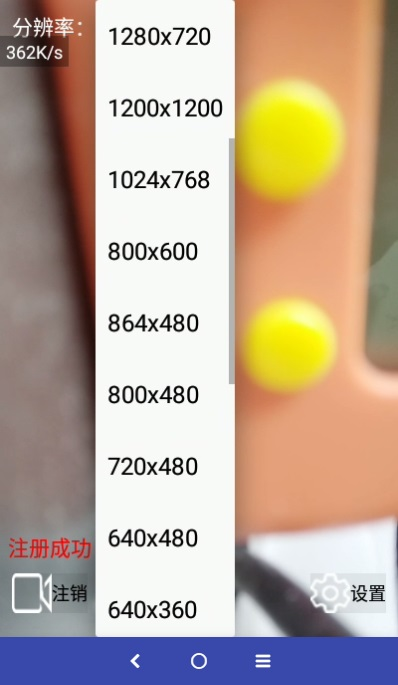
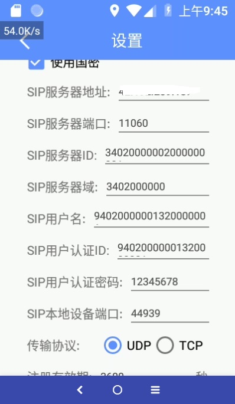
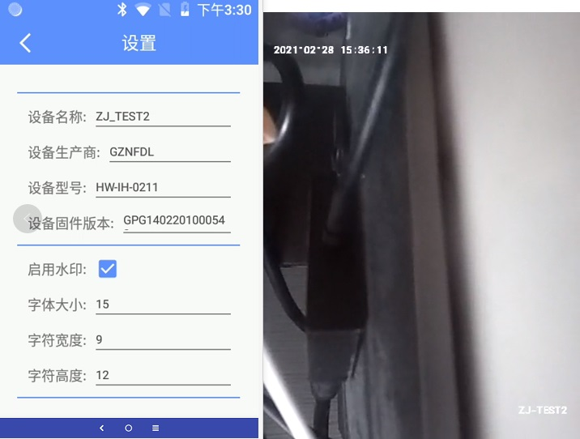

# NanGBD-Android

NanGBD-Android（即 Nanuns GB Device，国标设备端）是一套支持 GB/T 28181 和 GB 35114 [国标协议](https://github.com/nanguantong/GB-Doc)的安卓设备端应用。  
NanGBD 系列支持 Windows、Linux、Mac、Android、iOS、ARM 全平台。

# 应用场景

* 可用于安卓设备如智能穿戴设备（如安全帽）、门铃等终端。
* 可用于安卓设备的非标转国标需求，利旧改造。
* 可用于跨网互联互通、音视频推流、语音双向对讲等国标场景。

# 功能特性

- [X]  兼容国标 GB-T 28181-2011、GB-T 28181-2016、GB 35114
- [X]  设备支持公网/内网环境
- [X]  设备注册、注销、周期性保活
- [X]  设备信息设置与获取
- [X]  设备在线、离线状态维护与获取
- [X]  设备目录、移动位置、报警订阅与通知
- [X]  设备控制，包括云台控制、强制关键帧、远程启动、录像控制、报警复位、设备配置、签名控制、加密控制
- [X]  设备摄像头或屏幕、麦克风采集与推流
- [X]  设备视频参数配置，如帧率、码率、分辨率
- [X]  设备PS/H264/H265封装流、音频G711A编码
- [X]  设备实时取流
- [X]  设备录制、取历史流
- [X]  设备公网/内网语音对讲
- [X]  OSD 时间戳水印和自定义文字水印
- [X]  GB 35114 A级
- [X]  设备授权认证（App key / secret）
- [X]  代码加密与混淆
- [X]  可定制化功能（如 GB 35114 B/C 级 等）

# TODO

- [ ]  兼容国标 GB-T 28181-2022
- [ ]  兼容国标 GA-T 1400
- [ ]  支持 RTCP 码流传输控制
- [ ]  集成 WebRTC，并进行 UDP 传输改造
- [ ]  音频 3A 算法优化
- [ ]  ...

# 编译运行

整个核心代码分为 app 端（java 层）和 library 端（cpp 层）。  
**注：cpp 编译库都位于 library/src/main/jniLibs/ 对应架构目录下。**

0. 准备环境
   * 安装 Android Studio 工具 和 java8 + 环境。
   * 修改 local.properties 中的 sdk.dir（安卓 sdk 路径）与 ndk.dir（安卓 ndk 路径），如：
     `sdk.dir=/Users/Nanuns/Library/Android/sdk`  
     `ndk.dir=/Users/Nanuns/Library/Android/sdk/ndk-bundle`

1. 编译 osip 与 eXosip  
   安卓端编译 FFmpeg 相关这里就不展开，可自行摸索编译。注意 osip 和 eXosip 版本一定要对应，否则可能会出现不兼容的情况。我们这里选择 osip2-5.3.0 和 eXosip2-5.3.0。
   可参考 [eXosip](https://github.com/xueqing/exosip) 和 [eXosip 交叉编译](https://blog.csdn.net/zhuyunier/article/details/79085345)

2. 编译 GmSSL  
   进入 library/src/main/sh/ 目录，运行 `bash ./build-gmssl4android.sh` 将生成全部架构的包，包括 armeabi-v7a、arm64-v8a、x86、x86_64。
   也可以添加运行参数如：`bash ./build-gmssl4android.sh [arg1-arch] [arg1-abi] [arg2-api]`，其中：

   * [arg1-arch] 表示安卓架构，可选项为：arm、arm64、x86、x86_64、mips、mips64
   * [arg1-abi]  表示安卓 ABI，可选项为：armeabi-v7a、arm64-v8a、x86、x86_64、mips、mips64
   * [arg1-api]  表示支持安卓最低 SDK API 版本，可选项为：21、或者高于 21 的版本

3. 编译 FFmpeg  
   安卓端交叉编译 FFmpeg 相关这里就不展开，可自行摸索编译。注意我们这里使用版本 FFmpeg-v4.3.1，增加了 mediacodec 硬件编解码模块，且支持 H265。

### 依赖库

* [GmSSL](https://github.com/guanzhi/GmSSL) 用于 GB 35114 SIP 安全信令交互
* [osip](https://ftp.gnu.org/gnu/osip/) 用于 SIP 信令交互
* [eXosip](https://download.savannah.gnu.org/releases/exosip/) 用于 SIP 信令交互
* [libyuv](https://github.com/lemenkov/libyuv) 用于视频格式转换与处理
* [ffmpeg](https://ffmpeg.org/) 用于音视频处理

# 运行截图

# 联系我们
[上海南宙科技有限公司](https://www.nanuns.com)  
QQ 群：720153574

# 免责声明

请务必认真阅读和理解本《免责声明》中规定的使用权利和限制。

NanGBD-Android（以下简称“本软件”）规定的使用权利及限制如下：

1. 本软件供开发人员调试开发使用，严禁用于一切侵权、侵害他人利益、违法违禁等不当行为；使用本软件造成的一切后果由用户自行承担，请悉知！  
2. 本软件其功能实现所依托的各项权限，需经由作者同意授权后才允许使用，用户需提前了解本软件的各项权限的作用以及利弊，并自行决定是否授予本软件权限。
3. 用户不得对本软件进行反向工程（Reverse engineer）、反向编译（Decompile）、反汇编（Disassemble）或二次打包发布，违者属于侵权行为，并承担由此产生的一切直接和间接后果。
4. 由于本软件使用了部分开源软件，本软件及本软件作者不承担由此引起的直接和间接损害责任。
